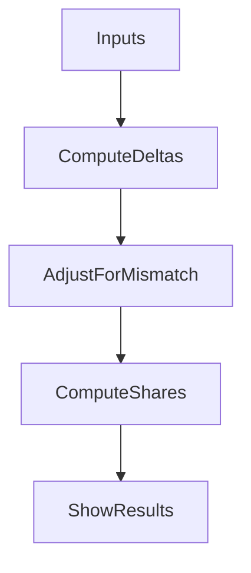

# Water Bill Split App Plan

## Approach

- Use a single‑file Streamlit app to collect current and previous readings for the main meter and two sub‑meters, plus bill totals (basic fees, usage fees).
- Compute usage deltas as `current - previous` for each meter; validate non‑negative values.
- Allocate **basic fees** 50/50. Allocate **usage fees** proportionally to sub‑meter deltas; if the sum of sub‑meter deltas differs from main delta, split the difference equally between the two parties (per your choice).

## Inputs & Calculations

- Inputs: main current/previous, sub‑1 current/previous, sub‑2 current/previous, basic fees total, usage fees total.
- Calculations:
  - `main_use = main_curr - main_prev`
  - `s1_use = s1_curr - s1_prev`, `s2_use = s2_curr - s2_prev`
  - `sub_sum = s1_use + s2_use`, `diff = main_use - sub_sum`
  - `adj_s1_use = s1_use + diff/2`, `adj_s2_use = s2_use + diff/2`
  - `usage_share_1 = usage_fees * (adj_s1_use / main_use)` and similarly for 2
  - `basic_share = basic_fees / 2`, `total_share = basic_share + usage_share`
- Guardrails: if `main_use <= 0`, or any delta < 0, show error; if `main_use == 0`, usage shares are 0.

## Files to Add/Update

- Create `[app.py](app.py)` with Streamlit UI and calculation logic.
- Optionally create `[README.md](README.md)` with run instructions and example inputs from the bill.

## Output

- Display a clear summary table for each party: usage units, usage fee share, basic fee share, total due.

## Notes from the Bill

- The sample bill shows basic fees and usage fees as separate totals; we’ll input them directly rather than deriving unit prices.

## Mermaid (Optional Data Flow)

